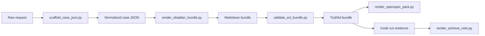

# 实现说明

## 仓库结构

在公开版仓库里，仓库根目录本身就是 Codex skill 根目录。这样安装后，Skill 对本地文件的相对引用仍然保持稳定。

```text
evolution-constraint-planner/
  SKILL.md
  scripts/
  templates/
  references/
  schemas/
  docs/
  examples/
  tests/
```

## 运行模型

ECL 有两层：

- Skill 层决定模型该如何行为
- Script 层负责渲染、校验和记录产物

脚本不会替代推理，它们只是把推理变成可检查、可审计、可验证的结构。

## CLI 架构

### `scripts/ecl.py`

这是公开暴露的 CLI 入口。它提供：

- `scaffold`
- `pre`
- `plan`
- `code`
- `achieve`

职责是：

- 调用正确的 helper script
- 执行阶段入场条件检查
- 拒绝虚假的成功信号
- 从渲染后的 note 中解析 handoff 真值

### `scripts/scaffold_case_json.py`

负责从原始请求生成 normalized case shell。它是创建合法 bundle 骨架的最简单入口，会自动补齐当前 schema 所需的阶段和 artifact 键位。

### `scripts/render_obsidian_bundle.py`

把 normalized JSON 编译成 markdown notes 和 companion docs。

### `scripts/validate_ecl_bundle.py`

它是整个流程的 truth gate。它会检查：

- 必需文件是否存在
- 必需 structured block 是否存在
- 必需字段是否齐全
- 强制多子代理阶段是否被诚实执行
- `code_ready=true` 是否真的满足 handoff quality bar

### `scripts/render_openspec_pack.py`

把已收敛的 ECL package 编译成 OpenSpec 视图。它只是导出面，不是第二套规划系统。

### `scripts/render_code_run.py`

负责写 `Runs/<run-id>/00-code-run.md` 及其关联执行证据。

### `scripts/render_achieve_note.py`

根据 achieve payload 写出 `Runs/<run-id>/03-achieve.md`。

## Bundle 编译流



## 产物表面

### 规划真值

- `05-constraint-ledger.md`
- `10-a-preprocess.md`
- `20-b-divergence.md`
- `30-c-requirements.md`
- `40-d-critique.md`
- `50-e-closure.md`
- `60-f-probes.md`
- `70-g-red-blue.md`
- `80-h-review.md`
- `98-j-compile-for-code.md`

### 编码真值

- `90-code-handoff.md`：唯一真实的执行入口
- `97-code-preflight.md`：执行用工作面，不能改写冻结语义
- `99-code-handoff.md`：面向用户和 coder 的最终汇总视图

### 契约 companion docs

- `91-canonical-contracts.md`
- `92-constraint-crosswalk.md`
- `95-execution-manifest.md`
- `96-code-batches.md`

### Run evidence

- `Runs/<run-id>/00-code-run.md`
- `Runs/<run-id>/01-verification.md`
- 如果被阻塞，则写 `Runs/<run-id>/02-reentry.md`
- 如果做 closure 判断，则写 `Runs/<run-id>/03-achieve.md`

## 模板系统

`templates/` 保存了 renderers 会填充的 markdown 形状：

- A-H 和 J 的阶段 note
- handoff note
- companion docs

这样就能保证 bundle 的外观结构稳定，而规划内容可以演进。

## Schema 策略

这套 schema 故意做得比较轻。ECL 不依赖外部数据库，也不依赖远程协议，而是把 bundle 本身当作持久真值面。

最重要的结构约束在这两个地方：

- `references/ecl-schema.md`
- `schemas/ecl-v2/schema.yaml`

validator 通常会比可读文档更严格。这是故意的。markdown 是给人读的，structured blocks 是拿来卡真值的。

## 为什么要有 `97-code-preflight.md`

很多规划系统会失真，是因为执行阶段开始直接改 handoff 本身。ECL 用两个文件把这件事分开：

- `90-code-handoff.md` 保存冻结后的实现含义
- `97-code-preflight.md` 保存实时执行状态

这样就可以边执行边同步进度，而不重新打开产品语义。

## 为什么要有 `99-code-handoff.md`

`90-code-handoff.md` 是机器真值入口，`99-code-handoff.md` 是给用户和 coder 查看的最终编译视图。它们相关，但不能互相替代。

## OpenSpec 导出

当用户需要 OpenSpec 风格产物时，ECL 会编译出：

- `proposal.md`
- `design.md`
- `tasks.md`
- `specs/...`

这些文件不是另一套作者源，而是已收敛 ECL 真值的投影视图。

## 示例工作区

仓库自带一个合法的 Stage A 示例，位于：

- `examples/stage-a-sample/case.json`
- `examples/stage-a-sample/bundle/`

它展示了：

- normalized case 的结构
- bundle 的编译布局
- 可公开发布的占位式绝对路径
- OpenSpec 导出结果

## 安装脚本

`scripts/install_skill.sh` 会把整个仓库复制到 `${CODEX_HOME:-$HOME/.codex}/skills/evolution-constraint-planner`，这样仓库既是源码仓库，也可以直接当作 Codex skill 使用。
